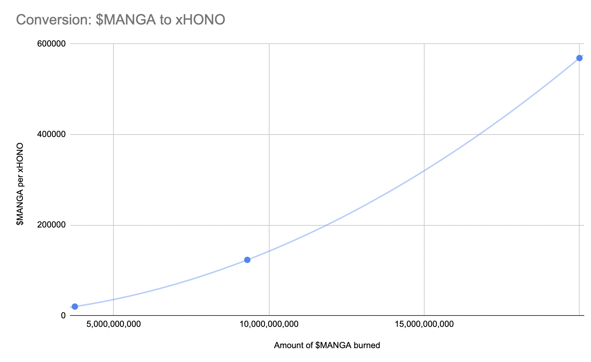

# $MANGA -> xHONO

Users can convert their $MANGA tokens into xHONO tokens. Manga Token holders have the option to swap their $MANGA for xHONO, with the maximum amount that can be obtained through this conversion capped at **111,922.78 xHONO** tokens.

**NOTE**: $MANGA will be burned upon conversion.

<figure><figcaption></figcaption></figure>

### $MANGA to xHONO conversion formula

The conversion formula is as follows:

$$
Amount\medspace of\medspace xHONO\medspace minted\medspace =\medspace \int \cfrac {1}{(\cfrac {x+A}{A})^2 * B}
$$

**x** = Amount of $MANGA to be converted into xHONO

**A** = Amount of $MANGA already burned at the start of the xHONO launch

**B** = Initial price of xHONO in $MANGA

#### Simplified Explanation

<figure><figcaption></figcaption></figure>

Early participants will require fewer $MANGA tokens to convert into xHONO, while later participants will need more $MANGA to obtain the same amount of xHONO. As more $MANGA gets burned through conversions, the price of xHONO in $MANGA will increase.

#### **Effects of Monthly $MANGA Burn on xHONO Price**

The price of xHONO in $MANGA will continue to rise as more $MANGA is burned over time. Even if no additional conversions occur, any $MANGA burn will still drive the conversion rate upwards.
